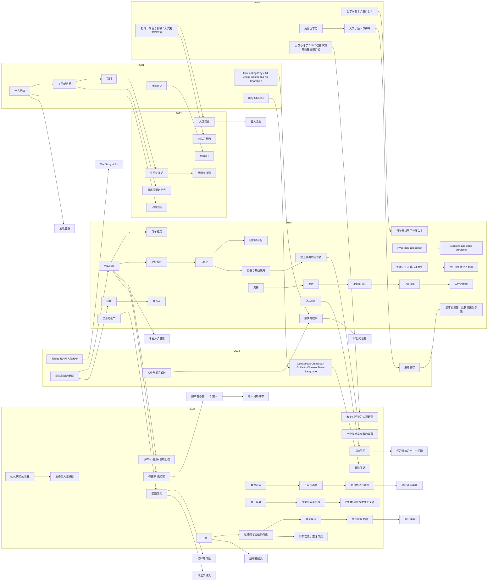

```mermaid
flowchart LR
subgraph 2020
  荒诞医学史
  异类心理学["异类心理学：40个改变认知的疯狂思想实验"]
  %% JavaScript["JavaScript: The Good Parts"]
  哲学家都干了些什么2020["哲学家都干了些什么？"]
  %% 青春
  %% 上帝掷骰子吗["%% ？量子物理史话"]
  %% 阴翳礼赞
  %% 薛兆丰经济学讲义
  天才狂人与梅毒["天才、狂人与梅毒"]
  枪炮病菌与钢铁["枪炮、病菌与钢铁：人类社会的命运"]
  %% 娱乐至死
  %% 寂寞的游戏
end

subgraph 2021
  %% 大国志
  HowAKingPlays["How a King Plays: 64 Chess Tips from a Kid Champion"]
  %% TheNonDesignersDesignBook["The Non-Designer’s Design Book"]
  MisterO["Mister O"]
  我们
  美丽新世界
  一九八四
  %% ThePragmaticProgrammer["The Pragmatic Programmer: Your Journey to Mastery"]
  DirtyChinese["Dirty Chinese"]
end

subgraph 2022
  复明症漫记
  %% Cats
  %% 父与子
  自私的基因
  %% 手册["%% 手册：危急时刻如何绝处逢生"]
  动物庄园
  %% 沉默的大多数
  失明症漫记
  人类简史
  MisterI["Mister I"]
  %% 突然响起了一阵敲门声["突然，响起了一阵敲门声"]
  重返美丽新世界
end

subgraph 2023
  %% AppliedLetteringAndDesign["Applied lettering and design"]
  %% 关于上班这件事
  人类群星闪耀时
  %% 13ArchitectsChildrenShouldKnow["13 architects children should know"]
  %% 生命中不能承受之轻
  写给大家的西方美术史
  霍乱时期的爱情
  病毒星球
  OutrageousChinese["Outrageous Chinese: A Guide to Chinese Street Language"]
end

subgraph 2024
  法治的细节
  人性的枷锁
  SolutionsAndOtherProblems["Solutions and other problems"]
  世上最美的溺水者
  屁事也疯狂["屁事也疯狂：肛肠科医生手记"]
  爱情与其他魔鬼
  我们八月见
  八月见
  象棋的故事
  %% 一地鸡毛
  局外人
  百年孤寂
  鼠疫
  枯枝败叶
  寻欢作乐
  HyperboleAndAHalf["Hyperbole and a half"]
  百年孤独
  也许你该找个人聊聊
  %% 六里庄遗事
  蛤蟆先生去看心理医生
  哲学家都干了些什么2024["哲学家都干了些什么？"]
  怎样临帖
  毛姆的书单
  %% DevelopingAppsWithGPT4AndChatGPT["Developing Apps with GPT-4 and ChatGPT"]
  面纱
  %% Hooked
  %% TheFineArtOfSmallTalk["The Fine Art of Small Talk"]
  %% 一个叫欧维的男人决定去死
  刀锋
  %% 悉达多
  %% 我与地坛
end

subgraph 2025
  宝贵的人生建议
  一个海难幸存者的故事
  佩德罗巴拉莫["佩德罗·巴拉莫"]
  %% 给青年的十二封信
  书法百问
  没有人给他写信的上校
  亲爱的安吉拉维
  我们都应该做女性主义者
  %% 鳄鱼手记
  太白金星有点烦
  克拉拉与太阳
  香港俚语
  改变心理学的40项研究
  莫失莫忘
  长安的荔枝
  食南之徒
  圆圈正义
  %% 爱的五种语言
  我厌男["我，厌男"]
  5000天后的世界
  阿尔吉侬查理与我["阿尔吉侬、查理与我"]
  献给阿尔吉侬的花束
  %% 唐人街三十二像
  三体
end

%% TODO:
法律的悖论
超新星纪元
活着为了讲述
昨日的世界
TheStoryOfArt["The Story of Art"]
学习书法的十三个问题
桃花源没事儿
如果在冬夜一个旅人["如果在冬夜，一个旅人"]
看不见的城市
远山淡影
刑法学讲义
五号屠场
智人之上

%% 2020 ~~~ 2021 ~~~ 2022 ~~~ 2023 ~~~ 2024 ~~~ 2025


%% 加西亚·马尔克斯
霍乱时期的爱情 --> 百年孤独 --> 百年孤寂
百年孤独 --> 枯枝败叶
枯枝败叶 --> 八月见 --> 我们八月见
八月见 --> 爱情与其他魔鬼 --> 世上最美的溺水者 --> 一个海难幸存者的故事
百年孤独 --> 没有人给他写信的上校
百年孤独 --> 佩德罗巴拉莫 --> 如果在冬夜一个旅人 --> 看不见的城市
百年孤独 --> 活着为了讲述

%% 毛姆
刀锋 --> 面纱 --> 毛姆的书单 --> 寻欢作乐 --> 人性的枷锁

%% 哲学
哲学家都干了些什么2020 --> 哲学家都干了些什么2024

%% 心理咨询
蛤蟆先生去看心理医生 --> 也许你该找个人聊聊

%% 心理学 
异类心理学 --> 改变心理学的40项研究

HyperboleAndAHalf --> SolutionsAndOtherProblems

霍乱时期的爱情 --> 鼠疫
%% 加缪
鼠疫 --> 局外人


%% 茨威格
人类群星闪耀时 --> 象棋的故事 --> 昨日的世界

%% chess
HowAKingPlays --> 象棋的故事

%% 医学
荒诞医学史 --> 天才狂人与梅毒 --> 病毒星球 --> 屁事也疯狂

%% 人类学
枪炮病菌与钢铁 --> 人类简史 --> 智人之上
枪炮病菌与钢铁 --> 自私的基因

%% 艺术史
写给大家的西方美术史 --> TheStoryOfArt

%% 反乌托邦
一九八四 --> 美丽新世界 --> 我们 --> 失明症漫记 --> 复明症漫记
一九八四 --> 动物庄园
一九八四 --> 五号屠场
美丽新世界 --> 重返美丽新世界

MisterO --> MisterI

DirtyChinese --> OutrageousChinese --> 香港俚语

%% 马伯庸
食南之徒 --> 长安的荔枝 --> 太白金星有点烦 --> 桃花源没事儿

%% 女性主义
我厌男 -->  亲爱的安吉拉维 --> 我们都应该做女性主义者

%% 科幻
三体 --> 献给阿尔吉侬的花束 --> 莫失莫忘 --> 克拉拉与太阳 --> 远山淡影
献给阿尔吉侬的花束 --> 阿尔吉侬查理与我
三体 --> 超新星纪元

%% KK

5000天后的世界 --> 宝贵的人生建议

%% 书法 
怎样临帖 --> 书法百问 --> 学习书法的十三个问题

%% 罗翔
法治的细节 --> 圆圈正义 --> 法律的悖论 
圆圈正义 --> 刑法学讲义

2025 ~~~ 2024 ~~~ 2023 ~~~ 2022 ~~~ 2021 ~~~ 2020
```